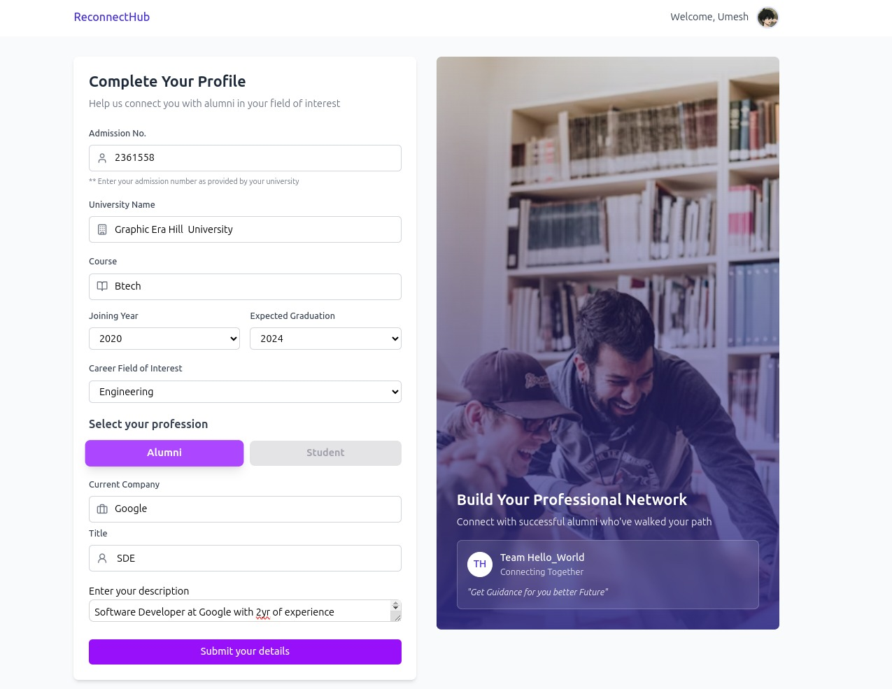

# **ReunionHub** 🚀🎓  
**Bridging the Gap Between Students and Alumni for Mentorship & Career Growth**  

---

## 🌟 **Overview**  
Many students struggle to connect with alumni for **mentorship, career guidance, internships, and job opportunities** due to the lack of a **centralized platform**. Existing solutions, like personal contacts and LinkedIn, are often **ineffective, unstructured, and inaccessible**.  

**ReunionHub** provides a **dedicated networking and mentorship platform** that enables students and alumni to engage seamlessly, share industry insights, and access career opportunities.  

---  

## 🚀 **Key Features**  
✅ **Alumni Directory** – Search and connect with alumni based on skills, industry, and interests.  
✅ **Mentorship Matching** – AI-powered mentor-mentee pairing for personalized guidance.  
✅ **Job & Internship Board** – Alumni can post opportunities directly for students.  
✅ **Discussion Forums** – A space for Q&A, career advice, and industry trends.  
✅ **Event Scheduling** – Organize and attend webinars, reunions, and networking events.  
✅ **Real-Time Chat** – Secure messaging system for student-alumni interaction.  

---  

## 🛠️ **Tech Stack**  
💻 **Frontend:** Next.js (React), TypeScript, Tailwind CSS  
🛠 **Backend:** Next.js API Routes (Serverless)  
🗄 **Database:** Prisma ORM with PostgreSQL / MySQL  
🔑 **Authentication:** Clerk for user authentication  
🚀 **Hosting:** Vercel (Frontend & Serverless Backend)  

---  

## 📸 **Project Screenshots**  
Here are some glimpses of **ReunionHub**'s interface:  

### 🎓 **Student Dashboard**  
  

### 📅 **Alumni Dashboard (Webinars)**  
  

### 🌟 **Alumni Dashboard (Referrals)**  
  

### 🌐 **Profile Creation**  
  

> *For the best viewing experience, all images have been cropped and optimized.*  

---  

## 📥 **Installation & Setup**  

### 🔹 **Clone the Repository**  
```bash  
git clone https://github.com/UmeshKumar0143/ReunionHub.git  
cd ReunionHub  
```

### 🔹 **Project Setup**  
```bash  
npm install  
npm run dev  # Runs the Project  
```

---  

## 💡 **How It Works**  
1️⃣ **Students create profiles and explore the alumni network.**  
2️⃣ **AI-powered mentor matching connects students with relevant alumni.**  
3️⃣ **Alumni share job/internship opportunities directly on the platform.**  
4️⃣ **Users engage in discussions, attend networking events, and exchange knowledge.**  

---  

## 🎯 **Future Enhancements**  
🚀 **AI-powered resume builder** to help students create industry-standard resumes.  
🚀 **Gamification (Badges, Leaderboards)** to encourage engagement.  
🚀 **Blockchain-based verification** for skill endorsements.  

---  

## 🤝 **Contributing**  
We welcome contributions! Follow these steps to contribute:  

1. Fork the project  
2. Create a new branch (`git checkout -b feature-branch`)  
3. Commit changes (`git commit -m "Added a new feature"`)  
4. Push to the branch (`git push origin feature-branch`)  
5. Open a Pull Request  

---  

## 📜 **License**  
This project is licensed under the **MIT License**.  

---  

> *Designed for students. Built by students. Empowering the future.* 🚀  
